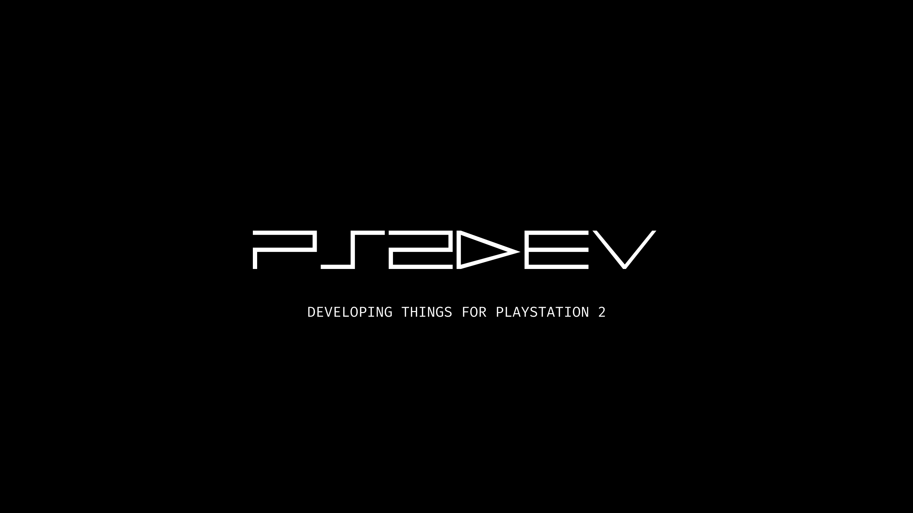
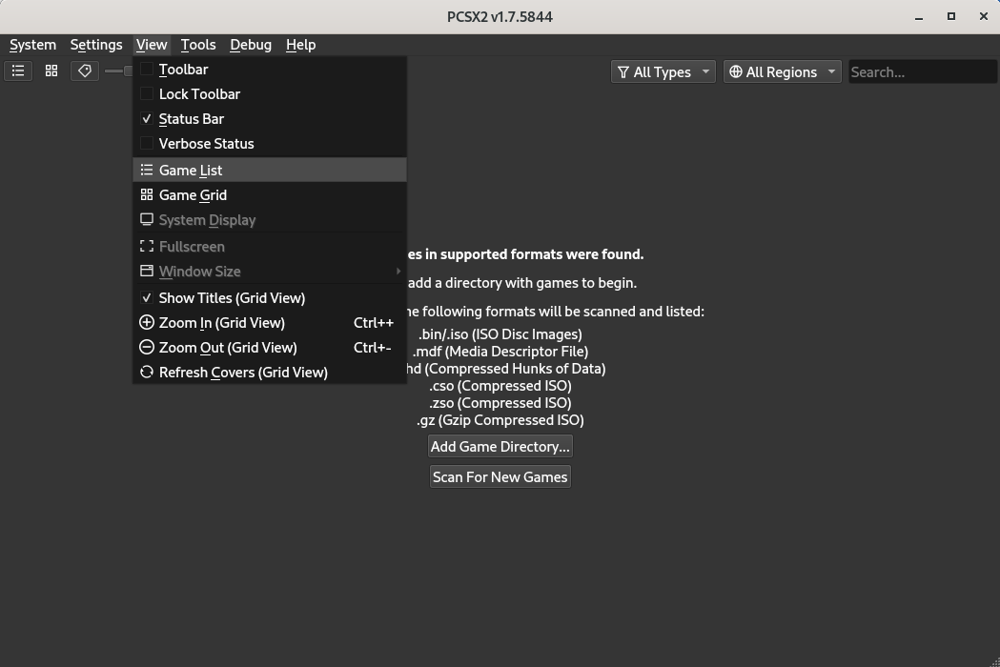
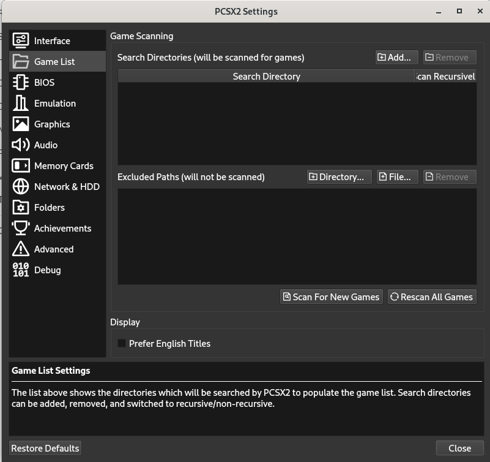
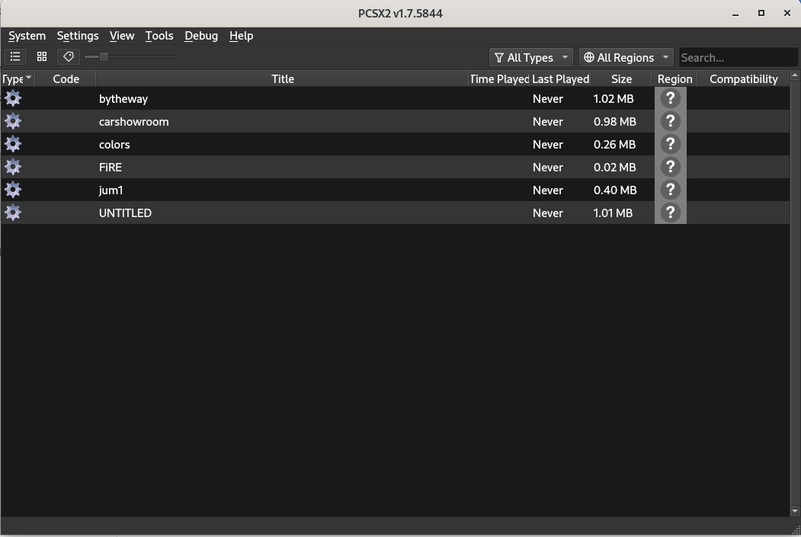

<h1 align="center">PS2 DEV WORLD</h1>

<div align="center">
  
</div>

This repository aims to bring together “everything” about the game and application development scenario for PlayStation 2. Here you will find all the tools, tutorials (videos), documents, etc. Check it all out below!

## Contents:

1. Engines
    - [AthenaEnv](#engines)
    - [BennuGD](#engines)
    - [Enceladus](#engines)
    - [Nichola's PS2 Engine](#engines)
    - [PlayLua Engine](#engines)
    - [RenderWare SDK 3.1](#engines)
    - [Tyra](#engines)
    - [Xenity Engine](#engines)
2. [Documents](#documents)
3. [Video Tutorials](#tutorials)
4. [Tools](#tools)
  - Showcases
    - [PPC Monitor](#showcases)
5. [Samples](#samples)
6. [Websites](#websites)
7. [YouTube Channels](#youtube)
8. [Projects](#projects)
9. [PS2 Code Source Leaked](#ps2-code-source-leaked)
10. [Contribute](#contribute)

<<<<<<< HEAD
<br>
<br>
<br>
<br>
<br>
<br>
<br>
=======
------
>>>>>>> e86d951 (update readme)
<br>

### Engines

- [AthenaEnv](https://github.com/DanielSant0s/AthenaEnv)
- [BennuGD](https://www.bennugd.org)
- [Enceladus](https://github.com/DanielSant0s/Enceladus)
- [Nichola's PS2 Engine](https://github.com/nicholas477/PS2-Engine)
- [PlayLua Engine](https://github.com/cejtok/playluaengine)
- [RenderWare SDK 3.1](https://archive.org/details/rw310-ps2)
- [Tyra](https://github.com/h4570/tyra)
- [Xenity Engine](https://github.com/Fewnity)

### Documents

- English
  - Start
    - [PlayStation2 in Higher Education (So you want to be a Games Programmer?)](https://ps2-edu.tensioncore.com/articles/ps2ed.html)
    - [PlayStation2 In Higher Education (Higher Education Academy Presentation November 2005)](https://ps2-edu.tensioncore.com/articles/HEA_files/frame.html)
    - [Teaching Console Games Programming with the Sony PlayStation2 Linux Kit (5th Game-On Conference, Reading (UK) 2004)](https://ps2-edu.tensioncore.com/articles/cgaige04.pdf)
    - [The PS2 Direct Memory Access Controller](https://ps2-edu.tensioncore.com/articles/dmac.html)
    - [Using the DMAC in Games Programming](https://ps2-edu.tensioncore.com/articles/dmac2a.html)
  - Manual
    - [Level-1 Service and Procedures Manual (Version 4.0)](https://gamingdoc.org/technical-documentation/consoles/sony-playstation-2/official/service-manuals/level-1-service-and-procedures-manual-version-4-0)
    - [Level-1 Service and Procedures Manual (Version 5.0)](https://gamingdoc.org/technical-documentation/consoles/sony-playstation-2/official/service-manuals/level-1-service-and-procedures-manual-version-5-0)
    - [SCPH-30000 Series Service Manual (2nd Edition) [GH-004 / GH-005 / GH-006 / GH-007]](https://gamingdoc.org/technical-documentation/consoles/sony-playstation-2/official/service-manuals/level-1-service-and-procedures-manual-version-4-0-2)
    - [SCPH-30000 Series Service Manual (6th Edition) [GH-010 / GH-012]](https://gamingdoc.org/technical-documentation/consoles/sony-playstation-2/official/service-manuals/scph-30000-series-service-manual-6th-edition)
    - [SCPH-30000R Series Service Manual (1st Edition) [GH-013 / GH-014]](https://gamingdoc.org/technical-documentation/consoles/sony-playstation-2/official/service-manuals/level-1-service-and-procedures-manual-version-4-0-2-2)
    - [SCPH-30000/35000 Series Service Manual (4th Edition) [GH-013]](https://gamingdoc.org/technical-documentation/consoles/sony-playstation-2/official/service-manuals/scph-30000-35000-series-service-manual-4th-edition)
    - [SCPH-30000R Series Service Manual (4th Edition) [GH-015]](https://gamingdoc.org/technical-documentation/consoles/sony-playstation-2/official/service-manuals/scph-30000r-series-service-manual-4th-edition)
    - [SCPH-30000R Series Service Manual (6th Edition) [GH-015]](https://gamingdoc.org/technical-documentation/consoles/sony-playstation-2/official/service-manuals/scph-30000r-series-service-manual-6th-edition)
    - [SCPH-39000 Series Service Manual (1st Edition) [GH-017]](https://gamingdoc.org/technical-documentation/consoles/sony-playstation-2/official/service-manuals/scph-39000-series-service-manual-1st-edition)
    - [SCPH-39000 Series Service Manual (2nd Edition) [GH-017 / GH-019]](https://gamingdoc.org/technical-documentation/consoles/sony-playstation-2/official/service-manuals/scph-39000-series-service-manual-2nd-edition)
    - [SCPH-39000 Series Service Manual (4th Edition) [GH-022]](https://gamingdoc.org/technical-documentation/consoles/sony-playstation-2/official/service-manuals/scph-39000-series-service-manual-4th-edition)
    - [SCPH-50000 Series Service Manual (2nd Edition) [GH-023]](https://gamingdoc.org/technical-documentation/consoles/sony-playstation-2/official/service-manuals/scph-50000-series-service-manual-2nd-edition)
    - [SCPH-50000 Series Service Manual (2nd Edition) [GH-026]](https://gamingdoc.org/technical-documentation/consoles/sony-playstation-2/official/service-manuals/scph-50000-series-service-manual-2nd-edition-gh026)
    - [SCPH-70000 Series Service Manual (1st Edition) [GH-035]](https://gamingdoc.org/technical-documentation/consoles/sony-playstation-2/official/service-manuals/scph-70000-series-service-manual-1st-edition)
  - PlayStation Architecture
    - [PS2 Overview](https://psi-rockin.github.io/ps2tek)
    - [PS2 Architecture](https://www.copetti.org/writings/consoles/playstation-2)
  - Official Sony Documents (Hardware)
    - [EE Core Instruction Set Manual](https://github.com/DarrenRainey/PS2-Programming-Docs/blob/master/EE_Core_Instruction_Set_Manual.pdf)
    - [EE Core User's Manual](https://github.com/DarrenRainey/PS2-Programming-Docs/blob/master/EE_Core_Users_Manual.pdf)
    - [EE Overview Manual](https://github.com/DarrenRainey/PS2-Programming-Docs/blob/master/EE_Overview_Manual.pdf)
    - [EE User's Manual](https://github.com/DarrenRainey/PS2-Programming-Docs/blob/master/EE_Users_Manual.pdf)
    - [GS User's Manual](https://github.com/DarrenRainey/PS2-Programming-Docs/blob/master/GS_Users_Manual.pdf)
    - [GS User's Manual Supplement](https://github.com/DarrenRainey/PS2-Programming-Docs/blob/master/GS_Users_Manual_Supplement.pdf)
    - [MIPS Calling Convention](https://github.com/DarrenRainey/PS2-Programming-Docs/blob/master/MIPS_Calling_Conventions_Summary.pdf)
    - [SPU2 Overview](https://github.com/DarrenRainey/PS2-Programming-Docs/blob/master/SPU2_Overview_Manual.pdf)
    - [VU User's Manual](https://github.com/DarrenRainey/PS2-Programming-Docs/blob/master/VU_Users_Manual.pdf)
  - PlayStation 2 Linux
    - [PlayStation 2 Linux Games Programming - Dr Henry S Fortuna](https://ps2-edu.tensioncore.com/index.html)
  - 3D
    - [How do Video Game Graphics Work?](https://www.youtube.com/watch?v=C8YtdC8mxTU&t=770s)
    - [3D Math, Rendering, History PlayStation 2 - aap](https://www.youtube.com/watch?v=mZRzzZfSBbg)
    - [DOT3 Normal Mapping On The PS2](https://github.com/DarrenRainey/PS2-Programming-Docs/blob/master/ps2_normalmapping.pdf)
    - [Playstation 2 Vector Unit Instruction Manual](https://github.com/DarrenRainey/PS2-Programming-Docs/blob/master/vu-instruction-manual.pdf)
    - [PlayStation 2 Optimisations](https://github.com/DarrenRainey/PS2-Programming-Docs/blob/master/PS2Optimisations.pdf)
  - Samples
    - [PS2 Emotion Engine Library Sample Program Listings](https://archive.org/details/ps-2-emotion-engine-library-sample-program-listings/mode/2up)
  - Deckard
    - [IOP/Deckard](https://www.psdevwiki.com/ps2/IOP/Deckard)
    - [PPC Monitor](https://israpps.github.io/PPC-Monitor)
  - Others
    - [Designing And Programming The Emotion Engine](https://github.com/DarrenRainey/PS2-Programming-Docs/blob/master/eeprogramming.pdf)
    - [PAD low-level specs by [RO]man / (v1.0, 2004, Florin Sasu)](https://github.com/DarrenRainey/PS2-Programming-Docs/blob/master/padspecs.txt)
    - [Sony's Emotionally Charged Chip](https://github.com/DarrenRainey/PS2-Programming-Docs/blob/master/Sony's%20Emotionally%20Charged%20Chip.pdf)
    - [TX79 Core Architecture](https://github.com/DarrenRainey/PS2-Programming-Docs/blob/master/tx79architecture.pdf)
    - [Vector Unit Architecture For Emotion Synthesis](https://github.com/DarrenRainey/PS2-Programming-Docs/blob/master/Vector%20Unit%20Architecture%20for%20Emotion%20Synthesis.pdf)   
- Portuguese Brazilian
  - [Arquitetura e Organização de Processadores - PlayStation 2](https://www.inf.ufrgs.br/~flavio/ensino/cmp237/PlayStation2.pdf)

### Tutorials

- Installation PS2SDK
  - [EN - Installation PS2SDK](https://www.youtube.com/watch?v=bsXaR_nWPFY&list=PLeIaNbfDd3faJ6HsjfZfyLgsZLSMcxaUt)
  - [PT - Installation PS2SDK](https://www.youtube.com/watch?v=wEVsYnqjOLA&list=PLeIaNbfDd3fYj3fwXQNdg3kCrcYmJIS_A)
- [Making a PS2 Game - Tom Marks](https://www.youtube.com/watch?v=kX_JpzxR2Qg&list=PLFZsvEE0TWOsFhZr-9KwLED3Rzlwra_Rm)

### Tools

- PS2SDK Official
  - [Next Generation Playstation Development Software GCC Source 0.2.0 - 0.3.0](https://archive.org/details/next-generation-playstation-development-software-gcc-source-0.2.0-0.3.0-ps2)
  - [PlayStation 2 July 2005 SDK (version 3.0.3)](https://archive.org/details/PlayStation2July2005SDKversion3.0.3) 
- PS2SDK Homebrew
  - [binutils-gdb](https://github.com/ps2dev/binutils-gdb) - Contains various GNU compilers, assemblers, linkers, 
debuggers, etc., plus their support routines, definitions, and documentation (GDB)
  - [FluidSynth](https://github.com/ps2dev/fluidsynth) - Software synthesizer based on the SoundFont 2 specifications
  - [GCC](https://github.com/ps2dev/gcc) - Contains the GNU Compiler Collection (GCC)
  - [GSKIT](https://github.com/ps2dev/gsKit) - GSKIT is a C interface to the PS2 Graphics Synthesizer
  - [libtap](https://github.com/ps2dev/libtap) - Write tests in C
  - [Lua](https://github.com/ps2dev/lua) - Lua language
  - [lwip](https://github.com/ps2dev/lwip) - lwIP is a small independent implementation of the TCP/IP protocol suite
  - [mymc](https://github.com/ps2dev/mymc) - A public domain utility for working with PlayStation 2 memory card images
  - [newlib](https://github.com/ps2dev/newlib) - Unofficial mirror of sourceware newlib repository
  - [ps2-packer](https://github.com/ps2dev/ps2-packer) - Create packed ELF files to run on the PS2
  - [PS2Client](https://github.com/ps2dev/ps2client) - Desktop clients to interact with ps2link and ps2netfs
  - [ps2dev](https://github.com/ps2dev/ps2dev) - Main PS2 Repo for build the whole environment in your local machine and/or docker image
  - [PS2ETH](https://github.com/ps2dev/ps2eth) - PS2 Ethernet drivers (incl. SMAP)
  - [ps2gdb](https://github.com/ps2dev/ps2gdb) - ps2gdbStub is a tcp stub for the gnu debugger
  - [ps2gl](https://github.com/ps2dev/ps2gl) - ps2gl is an OpenGL*-like API for the ps2
  - [PS2Link](https://github.com/ps2dev/ps2link) - PS2Link is a 'bootloader' which, used together with an Ethernet driver and a TCP/IP stack, enables you to download and execute software on your PS2
  - [PS2SDK PORTS](https://github.com/ps2dev/ps2sdk-ports) - Ports of useful libraries to PS2SDK
  - [ps2stuff](https://github.com/ps2dev/ps2stuff) - Library used by ps2gl
  - [ps2toolchain-dvp](https://github.com/ps2dev/ps2toolchain-dvp) -dvd This program will automatically build and install a DVP compiler which is used in the creation of homebrew software for the Sony PlayStation® 2 videogame system
  - [ps2toolchain-ee](https://github.com/ps2dev/ps2toolchain-ee) - This program will automatically build and install an EE compiler which is used in the creation of homebrew software for the Sony PlayStation® 2 videogame system
  - [ps2toolchain-iop](https://github.com/ps2dev/ps2toolchain-iop) - This program will automatically build and install a IOP compiler which is used in the creation of homebrew software for the Sony PlayStation® 2 videogame system
  - [pthread-embedded](https://github.com/ps2dev/pthread-embedded) ???
  - [ps2toolchain](https://github.com/ps2dev/ps2toolchain) - This program will automatically build and install a compiler and other tools used in the creation of homebrew software for the Sony PlayStation® 2 videogame system
- PS2SDK Prussia
  - [Prussia SDK](https://github.com/Ravenslofty/prussia)
- Emulators
  - [DobieStation](https://github.com/PSI-Rockin/DobieStation)
  - [PCSX2](https://pcsx2.net)
- Games
  - [Naturo Shippuden Ultimate Ninja 5 Char Parameter Editor](https://github.com/zMath3usMSF/UN5CharPrmEditor)
- Others
  - [DKWDRV](https://github.com/DKWDRV)
  - [Emotion Engine Disassembler](https://github.com/TimoSalomaki/EmotionEngineDisassembler)
  - [Open PS2 Loader](https://github.com/ps2homebrew/Open-PS2-Loader)
  - [PS2rd - PS2 Remote Debugger](https://github.com/mlafeldt/ps2rd)
  - [vutrace](https://github.com/chaoticgd/vutrace)

### Showcases

- Deckard
  - [PPC Monitor](https://www.youtube.com/watch?v=m-fnXXXwius)

### Samples

1. Download this repository
  ```sh
  git clone https://github.com/playstation2-development/ps2dev-world
  ```
2. Download the [PCSX2](https://pcsx2.net) install and configure in your machine
3. Open the PCSX2 e go to "View" and after that "Game List"

<div align="center">
  
</div>

4. Add the path of the "samples" folder of this repository

<div align="center">
  
</div>

5. Run the sample

<div align="center">
  
</div>

- Sample List
  - [Bitmap 2D](https://www.youtube.com/watch?v=pBzF0DnRV8s&list=PLeIaNbfDd3fZdN3FwNRnjTNrU30DCdnbt&index=3&pp=gAQBiAQB)
  - [By The Way - Red Hot Chili Peppers](https://www.youtube.com/watch?v=k1y2-xKf3iw&list=PLeIaNbfDd3fZdN3FwNRnjTNrU30DCdnbt&index=8&pp=gAQBiAQB)
  - [Car Showroom](https://www.youtube.com/watch?v=cMxbgFGt1UA&list=PLeIaNbfDd3fZdN3FwNRnjTNrU30DCdnbt&index=9&t=19s&pp=gAQBiAQB)
  - [Clut](https://www.youtube.com/watch?v=xeTE0t7kZvw&list=PLeIaNbfDd3fZdN3FwNRnjTNrU30DCdnbt&index=14&pp=gAQBiAQBsAQB)
  - [Colors](https://www.youtube.com/watch?v=_PkHu1wgnNU&list=PLeIaNbfDd3fZdN3FwNRnjTNrU30DCdnbt&index=10&pp=gAQBiAQBsAQB)
  - [Cube](https://www.youtube.com/watch?v=kOGauz4D0tE&list=PLeIaNbfDd3fZdN3FwNRnjTNrU30DCdnbt&index=1&pp=gAQBiAQB)
  - [Cube VU1](https://www.youtube.com/watch?v=jYyWH41bAXA&list=PLeIaNbfDd3fZdN3FwNRnjTNrU30DCdnbt&index=5&pp=gAQBiAQB)
  - [Fire](https://www.youtube.com/watch?v=CtNrQEHGgKg&list=PLeIaNbfDd3fZdN3FwNRnjTNrU30DCdnbt&index=11&pp=gAQBiAQBsAQB)
  - [Hello World](https://www.youtube.com/watch?v=9MMv0GKHWSw&list=PLeIaNbfDd3fZdN3FwNRnjTNrU30DCdnbt&index=6&pp=gAQBiAQB)
  - [Many Teapots](https://www.youtube.com/watch?v=xEP-Gy3e3EA&list=PLeIaNbfDd3fZdN3FwNRnjTNrU30DCdnbt&index=2&pp=gAQBiAQB)
  - [PS2 Reality](https://www.youtube.com/watch?v=LrUwEuIqIko&list=PLeIaNbfDd3fZdN3FwNRnjTNrU30DCdnbt&index=13&pp=gAQBiAQBsAQB)
  - [Ray Tracing](https://www.youtube.com/watch?v=bzUQgqRxfuM&list=PLeIaNbfDd3fZdN3FwNRnjTNrU30DCdnbt&index=4&pp=gAQBiAQB)
  - [Space](https://www.youtube.com/watch?v=e5IKioq_tBg&list=PLeIaNbfDd3fZdN3FwNRnjTNrU30DCdnbt&index=12&pp=gAQBiAQBsAQB)
  - [Text](https://www.youtube.com/watch?v=FUcu1qOcvfQ&list=PLeIaNbfDd3fZdN3FwNRnjTNrU30DCdnbt&index=7&pp=gAQBiAQB)

### Websites

- [Lukasz.dk](http://www.ps2dev.com)
- [PlayStation 2 Linux Community](https://ps2linux.no-ip.info/playstation2-linux.com/index.html)
- [PlayStation 2 Linux Games Programming - Dr Henry S Fortuna](https://ps2-edu.tensioncore.com/index.html)
- [PS2 Home](https://www.ps2-home.com)
- [PS2DEV Forums](https://forums.ps2dev.org)
- [PSX Place](https://www.psx-place.com)

### YouTube

- [PS2DEV](https://youtube.com/@ps2dev)
- [Daniel Santos](https://www.youtube.com/@DanielSantosDev)
- [Fatality](https://www.youtube.com/channel/UCCjF3u3eh3NRYOiMdTT7bcQ)
- [Fewnity](https://www.youtube.com/@Fewnity)
- [Guilherme Lampert](https://www.youtube.com/@GuilhermeLampert)
- [Pablo Labs](https://www.youtube.com/@PabloLabs36)
- [Rick Gaiser](https://www.youtube.com/@RickGaiser)
- [Tecnocracia LTDA](https://www.youtube.com/@TecnocraciaLTDA)
- [Tom Marks Talk Code](https://www.youtube.com/@TomMarksTalksCode)
- [Wolf3s](https://www.youtube.com/@wolf3s567)

### Projects

- [Cuphead](https://www.youtube.com/@EclipseBladeStudio)
- [Game With Car](https://github.com/freebytego/gwc-ps2)
- [PS2 Doom](https://www.youtube.com/watch?v=y6BXCzrufCk)
- [Rock, paper and scissors](https://github.com/GDQR/Rock-paper-and-scissors)
- [TyraCraft](https://www.youtube.com/@TyraCraft)
- [TyraTale](https://github.com/Br4k2n/TyraTale)
- [Undertale](https://github.com/KreitinnSoftware/Undertale-PS2)

### PS2 Code Source Leaked

- [Bloody Roar 4 Review](https://archive.org/details/bloody-roar-4-review)
- [Extreme G3 Racing PS2 Source Code + PS2 SDK](https://archive.org/details/extreme-g3-racing-source-code)
- [Kelly Slater's Pro Surfer](https://github.com/historicalsource/kelly-slaters-pro-surfer)
- [Monsters, Inc. PS2 Source Code And Assets](https://archive.org/details/monstersinc-code-assets)
- [Oni Bungie](https://archive.org/details/oni-source)
- [Outlaw Golf Source Code (Hypnotix)](https://archive.org/details/GOLFCODE)
- Simpsons: Hit & Run
  - [The Simpsons Hit & Run - Code](https://github.com/RolphWoggom/shr.tar/)  
  - [The Simpsons: Hit & Run (May 27, 2003) (PS2) (Alpha) (executable only) + MAP](https://archive.org/details/SHAR-Alpha)
- [Tony Hawk's Underground](https://github.com/thug1src/thug)

## Contribute

Contributions are always welcome!

## Credits

Without you all this could not be done:

Dr Henry S Fortuna - [Nicholas](https://github.com/nicholas477) - [Fewnity](https://github.com/Fewnity) -
[Daniel Santos](https://github.com/DanielSant0s) - [Aionmagan](https://github.com/Aionmagan) -
[Sandro Sobczyński](https://github.com/h4570) - [PauloDevv](https://github.com/PauloDevv) -
[Lucas Teles](https://github.com/lucasoliveirateles) - [LuanAlcolea](https://github.com/LuanAlcolea) -
[Wellinator](https://github.com/Wellinator) - [Gustavo](https://github.com/GustavoFurtad2) -
[Lucas M. Dutra](https://github.com/terremoth) - [Guilherme Lampert](https://www.youtube.com/@GuilhermeLampert) -
[Tom Marks](https://github.com/phy1um) - [Rick Gaiser](https://github.com/rickgaiser) -
[Francisco Javier Trujillo Mata](https://github.com/fjtrujy) - [Naomi Peori](https://github.com/ooPo) -
[Julian Uy](https://github.com/uyjulian) - [Matías Israelson](https://github.com/israpps) -
[André Guilherme](https://github.com/Wolf3s) - [Pablo Labs](https://github.com/KreitinnSoftware) -
[Daniel R.](https://github.com/polybiusproxy) - [aap](https://github.com/aap) - 
[Br4k2n](https://github.com/Br4k2n) - [FreeByte](https://github.com/freebytego) - 
GuidoDQR - [CarLoid](https://github.com/CarLoiD)

PS: If someone is missing from the list, contact me!
